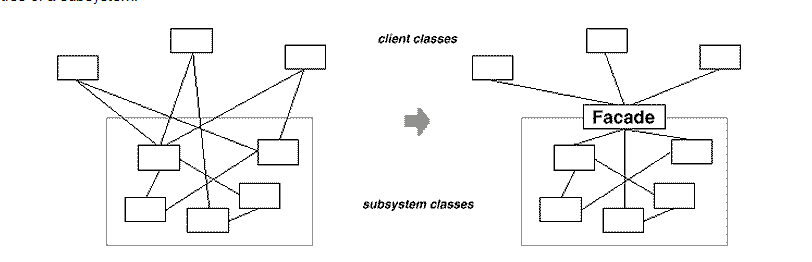

# Facade System

Literally this:

## In words:

You have a system `S`. `S` contains a bunch of different exposed components that interact. There are a number of external systems that use one or more of `S`'s exposed components. This is fine, but sometimes the external systems have to manage the interactions between `S` components. If this only happens a few times then this is fine, but the more extetnal systems have to know about the internal workings of `S` the more closely coupled those external systems become to `S`. 

For example, you might eventually want to change how the exposed components of `S` interact and find that you cannot do this without breaking some external systems that rely on the old patterns. 

The `facade pattern` is designed to overcome this: you keep the exposed components exposed, but create a single interface `IS` that contains most of the common things clients might want to do with `S`'s components. This way clients can rely on `IS` and remain decoupled from everything else. Generally as well in practice most client calls to a system with a bunch of exposed components only want to do a few common things anyway, so `IS` will probably cover the majority of client interactions with `S` and make them simpler too. The original components remain exposed for any clients that want to do advanced things.

the implementation of `IS` should be quite simple, mainly just delegating/translating calls to existing components.